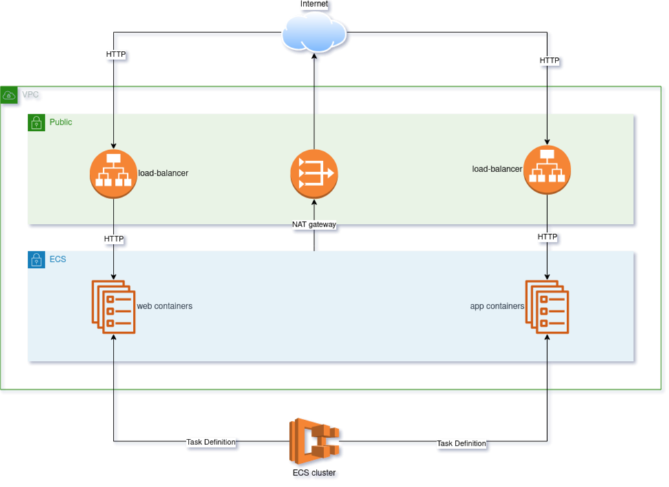

# ECS Playground

This repository contains a simple AWS environment built by [Terraform][terraform]. It demonstrates the usage of [Amazon Elastic Service][ecs].

**Prerequsites**

* Terraform => 0.12
* AWS account

## TL;DR

If you want to build the environment you have to just run the following commands.

```
export AWS_ACCESS_KEY_ID=<your key id comes here>
export AWS_SECRET_ACCESS_KEY=<your secret comes here>
terraform init
terraform apply -var-file=environments/dev.tfvars
```

## Components



There are two local modules to make the environment more flexible.

1. Module [vpc-network](modules/vpc-network/README.md) takes care of the networks in our VPC.
2. Module [ecs-module](modules/ecs-application/README.md) will prepare the ECS service in our cluster.

See the documentation of the modules for more information.

## Configuration

Input variables' default values support local development. You can easily overwrite them in the variable files inside the `environments` directory.

They are belonging to the proper CI/CD environment.

## Outputs

Terraform returns the DNS name for each of the defined services. See the [outputs file](outputs.tf) for more details.


[terraform]: https://www.terraform.io/
[ecs]:       https://aws.amazon.com/ecs/